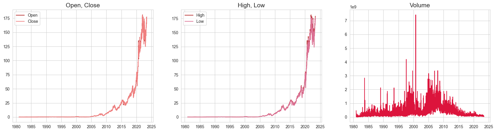
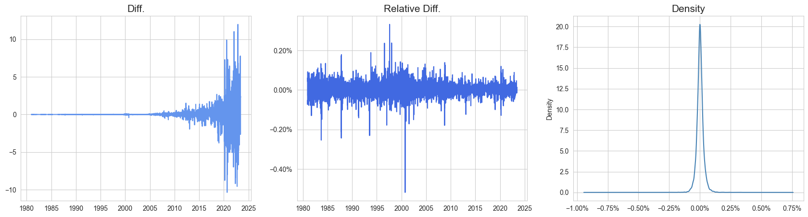
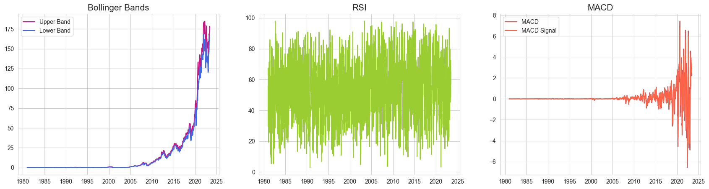
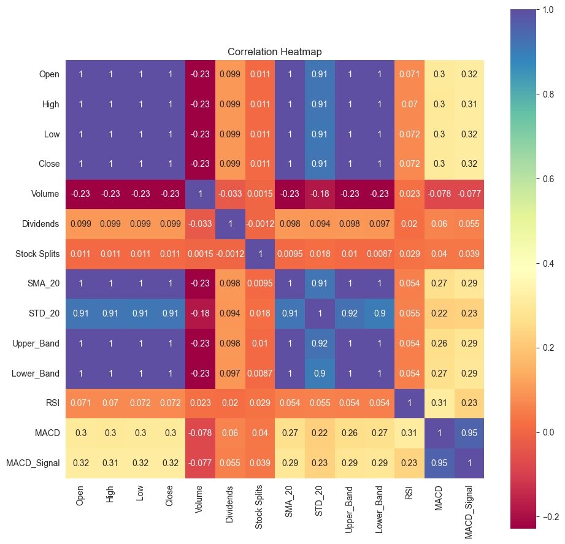
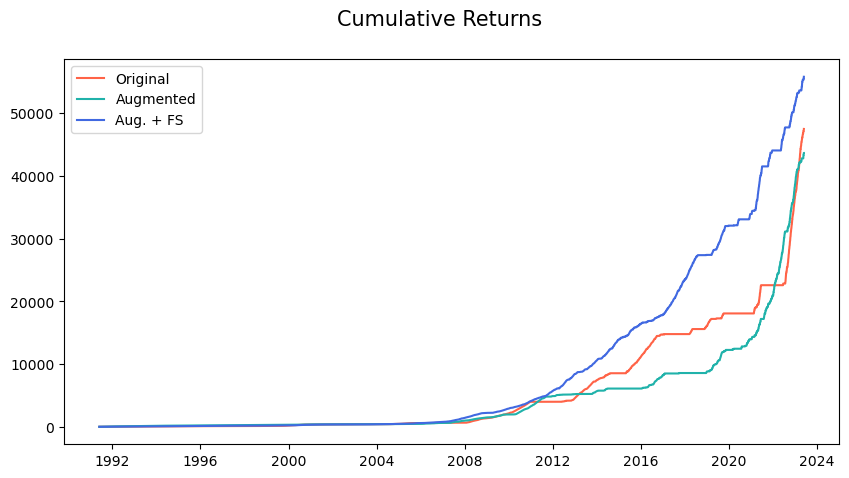

# ML Stock Prediction
> Stock return prediction using machine learning methods.

## Data Source
Historical stock data for Apple Inc. from Yahoo Finance up until the 30th of May, 2023.

```python
df = yf.Ticker(ticker).history(period=period, prepost=True)
```

## Target
To predict whether or not the stock price will increase the following day.

```python
df['Target'] = np.where(df['Close'].shift(-1) > df['Close'], 1, 0)
```


## Stock History EDA
### Price

Based on the Open/Close plot and High/Low plot, the price of Apple's stock has been steadily increasing with some fluctuations. Also, the Volume chart shows a substantial increase in trading volume during the years 1998 and 2007. This can be attributed to significant events like the introduction of the iMac and the iPhone, as well as the overall growth of the technology sector during those periods.

### Daily price change

Although the price difference increases as the stock price increases, the relative price change remains mostly consistent over the years.

### Other metrics


### Correlation


### Pairplot against Target value


## Training process
### Model
The GradientBoostingClassifier is chosen for its strength in capturing non-linear relationships, assessing feature importance, and robustness to outliers and missing data.

```python
from sklearn.ensemble import GradientBoostingClassifier
clf = GradientBoostingClassifier(random_state=0)
```

### Backtesting
Backtesting is used to more accurately evaluate the model's performance across diverse market conditions and minimise the impact of market anomalies in the test set.

```python
def backtest(model, X, y, init=1000, test=365, selector=None):
	preds = pd.DataFrame()
	for i in range(init, len(X), test):
		# Train test split
		X_train, X_test = X[:i], X[i:i+test]
		y_train, y_test = y[:i], y[i:i+test]
		close = X_test['Close'].copy()
		
		# Feature selection
		if selector is not None:
			selector.fit(X_train, y_train)
			selected = selector.get_support()
			X_train, X_test = X_train.iloc[:, selected], X_test.iloc[:, selected]
		
		# Fit model
		model.fit(X_train, y_train)

		temp = pd.concat([
			close,
			y_test,
			pd.DataFrame(model.predict(X_test), columns=['y_pred'], index=y_test.index),
			pd.DataFrame(model.predict_proba(X_test)[:,1], columns=['y_prob'], index=y_test.index)
		], axis=1)
		preds = pd.concat([preds, temp], axis=0)
	return preds
```

### Added features
To enhance the accuracy of the model, the following features have been added:

| Feature                                      | Details                                                                                                               |
|----------------------------------------------|-----------------------------------------------------------------------------------------------------------------------|
| SMA (Simple Moving Average)                  | Moving average of close prices.                                                                                       |
| STD (Moving Standard Deviation)              | Moving standard deviation of close prices.                                                                            |
| Last Dividend Payment Amount                 | Amount of the most recent dividend payment.                                                                           |
| Days Since Last Dividend Payment             | Number of days passed since the last dividend payment.                                                                |
| Days Since Last Stock Split                  | The number of days since the last stock split occurred.                                                               |
| Bollinger Bands                              | Upper and lower bands that represent price volatility.                                                                |
| RSI (Relative Strength Index)                | A momentum oscillator that measures the speed and change of price movements.                                          |
| MACD (Moving Average Convergence Divergence) | A trend-following momentum indicator that calculates the relationship between two moving averages of a stock's price. |
| Trend                                        | The sum of the target value over the last seven days.                                                                 |
| Ratios of Various Features                   | Ratios of features such as High/Close, Low/Close, SMA_365/SMA_90, and others.                                         |

### Feature selection
To further improve the model, scikit-learn's SequentialFeatureSelector is used to select the most relevant features.

```python
from sklearn.feature_selection import SequentialFeatureSelector
selector = SequentialFeatureSelector(clf, n_features_to_select='auto', n_jobs=-1)
results = backtest(clf, X, y, selector=selector)
```


## Results
### Score progression
|               | precision | recall   | f1-score |
|---------------|-----------|----------|----------|
| Original      | 0.51      | 0.33     | 0.40     |
| Augmented     | 0.51      | 0.33     | 0.40     |
| **Aug. + FS** | **0.51**  | **0.43** | **0.47** |

### Cumulative returns


The final results still leave much room for improvement, but they have clearly improved compared to the initial results.

## How to run
Run the notebooks in the following order:

    data_preparation.ipynb -> EDA.ipynb -> model.ipynb
